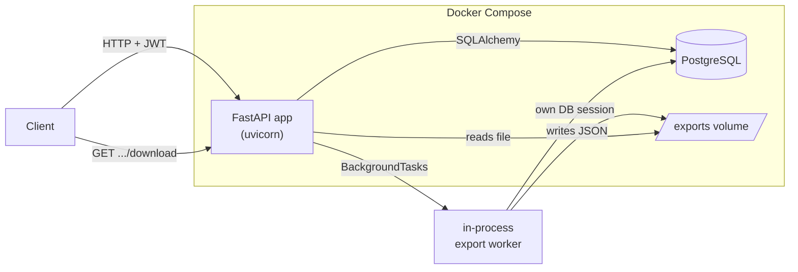
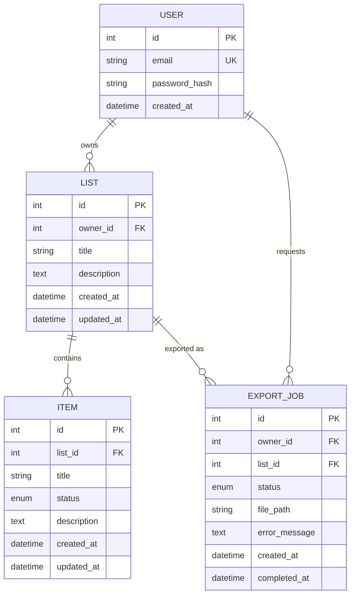

# DESIGN.md

## Domain flavor

**Reading tracker.** A `List` is a *shelf*, an `Item` is a *book* on that shelf. `Item.status`
models reading progress: `to_read` → `reading` → `finished`. The core resources stay named
`list`/`item` in code, routes, and schema — only the example data and field descriptions use
the reading-tracker framing, per the assignment's "keep the resources identifiable" rule.

## Architecture



Single FastAPI process, single Postgres instance, single Docker Compose file. No separate
worker container or broker — see [Async / export job design](#async--export-job-design) for
why that's an explicit, documented trade-off rather than an oversight.

## Project structure

```
app/
  core/       # config, DB session/engine, JWT + password hashing, error types, auth dependency
  models/     # SQLAlchemy ORM models (one file per table)
  schemas/    # Pydantic request/response models (never share models 1:1 with the ORM layer,
              # so internal columns like password_hash can never leak into a response)
  crud/       # DB query functions, one module per resource — kept thin and ownership-aware
              # (every read/update/delete query filters by owner_id in the WHERE clause, not
              # as an afterthought check on a fetched row)
  api/        # FastAPI routers; own authorization + orchestration, delegate persistence to crud/
  workers/    # background job functions (currently just the export worker)
  main.py     # app assembly: routers, exception handlers, lifespan
alembic/      # migrations
tests/        # pytest, one file per required test category from the assignment
```

Layering (`api` → `crud` → `models`) keeps authorization logic next to the request handling
where it's easy to review, while keeping raw SQLAlchemy queries out of the routers. It's a
conventional FastAPI layout, deliberately not over-engineered (no repository interfaces,
no DI container) — the project is one bounded context, not a codebase expecting swapped-out
persistence backends.

## Data model



**Indexes/constraints:**
- `users.email` — unique index (registration conflict + login lookup).
- `lists.owner_id`, `items.list_id`, `export_jobs.owner_id`, `export_jobs.list_id` — indexed
  FKs; every authorization check and every list/item/job query filters on one of these.
- `items.status` / `export_jobs.status` — native Postgres enum types, not free-text, so an
  invalid value is rejected by the database as a second line of defense even if application
  validation were ever bypassed.
- `lists.owner_id` → `users.id` and `items.list_id` → `lists.id` are `ON DELETE CASCADE`:
  deleting a user or list also deletes what it owns, avoiding orphaned rows.
- `export_jobs.list_id` → `lists.id` is `ON DELETE SET NULL`: a completed export job (and its
  already-generated file) is meant to outlive the source list being deleted later.
  `export_jobs.owner_id` is kept as a **denormalized** copy of the user id specifically so
  authorization checks on a job never depend on its (possibly now-null) `list_id`.

## Auth

JWT bearer tokens (`python-jose`), `HS256`, `sub` claim = user id, default 60-minute
expiry. Passwords hashed with `bcrypt` directly (72-byte input truncated per bcrypt's own
limit, applied consistently at hash- and verify-time). `POST /auth/login` accepts the
standard OAuth2 password-flow form fields (`username`, `password` — `username` holds the
email) specifically so FastAPI's `/docs` "Authorize" button works against it directly,
without a bespoke login schema just for Swagger.

`get_current_user` (a FastAPI dependency) decodes the bearer token and loads the user; every
protected route depends on it. There is no session state — invalidating a token before its
natural expiry (e.g. logout-everywhere) is not implemented, a reasonable gap for this scope.

## Authorization

Enforced in the `crud` layer, not just the router: every fetch-by-id function
(`get_owned(db, id, owner_id)`) takes the requester's `owner_id` as a required filter in the
SQL `WHERE` clause — there is no code path that fetches a row by id alone and checks
ownership afterward. A list or item belonging to another user is therefore indistinguishable
from one that doesn't exist at all: both return `404`, not `403`. This is a deliberate
choice — it avoids confirming to User B that a given id belongs to *someone*, at the minor
cost of a slightly less specific error for a legitimate 404. Item routes additionally 404 on
their own if the parent list itself isn't owned by the requester, before ever looking at
the item id.

## Async / export job design

The export endpoint creates an `ExportJob` row (`status=pending`) synchronously, then hands
the actual work to FastAPI's `BackgroundTasks`, which runs it in the same process *after* the
HTTP response has already been sent — satisfying "accepts the request immediately" without a
separate worker process or message broker.

**Trade-off, stated explicitly (as the assignment allows):** this is not durable. If the API
process is killed mid-export, that job is stuck at `pending` forever — there's no separate
queue to redeliver it. For the scale and scope of this assessment (a single API instance,
exports that complete in well under a second), that's an acceptable trade-off given the
added operational surface (Redis/RabbitMQ + a Celery/RQ worker container + retry/DLQ policy)
a durable queue would otherwise require. If this went to production with multiple API
replicas or exports large enough to be slow, the fix would be: a durable queue (e.g. Celery
+ Redis/RabbitmQ) with a separate worker deployment, so a crashed API instance doesn't strand
in-flight jobs, and so the job can be retried automatically on failure.

The worker opens its **own** DB session (`SessionLocal()`) rather than reusing the
request-scoped one, because by the time a `BackgroundTasks` callback runs, the request's
`get_db` dependency has already closed its session in its `finally` block.

On any exception during export, the job is marked `failed` with the exception message
recorded — the source list and its items are never touched by the export path, so a failed
export cannot corrupt them.

## Pagination

`limit` (default 20, max 100) / `offset` query params on every collection endpoint, returning
`{"items": [...], "total": N, "limit": ..., "offset": ...}`. Chosen over cursor pagination for
simplicity — appropriate for expected per-user data volumes (personal lists/items, not a
firehose collection), and it lets a client jump to an arbitrary page, which a reviewer poking
at `/docs` will find easier to try by hand than opaque cursors.

## Error handling

One shape for every error: `{"error": {"code": "<snake_case>", "message": "<text>"}}`
(`code` is stable and machine-checkable; `message` is for humans). Status codes:

| Code | HTTP | Used for |
|---|---|---|
| `unauthorized` | 401 | missing/invalid/expired token, bad login credentials |
| `forbidden` | — | reserved; not currently emitted — see [Authorization](#authorization) for why 404 is used instead |
| `not_found` | 404 | id doesn't exist, or belongs to another user |
| `conflict` | 409 | duplicate email, export not ready for download |
| `validation_error` | 422 | pydantic body/query validation |

## Testing strategy

Automated tests (`pytest`) run against an **in-memory SQLite** database via a `get_db`
dependency override, not the Postgres container. This is a deliberate trade-off:
- Fast (`pytest -v` completes in seconds, no Docker needed), hermetic, and works in CI without
  a Postgres service container.
- The ORM/business logic under test (ownership filtering, pagination math, status
  transitions, JWT flow) is identical regardless of backend.
- The gap: SQLite doesn't enforce the Postgres-native `item_status`/`export_status` enum
  types or true FK constraint semantics the same way Postgres does. That's why one of the
  bugs caught during manual end-to-end testing against the real Docker/Postgres stack (see
  below) was exactly there — a SQLAlchemy `Enum` binding its Python member's `.name`
  ("PENDING") instead of `.value` ("pending"), which Postgres's native enum type rejected but
  SQLite's looser CHECK-constraint emulation didn't catch. Fixed via `values_callable` on both
  enum columns, then re-verified against the live Postgres container.

Manual test cases (including all six required robustness cases) are in **TESTING.md**, run
against the real `docker compose up` stack.

## Assumptions

- "User credentials" = email + password (no username, no OAuth/social login, no MFA).
- One list level of nesting (list → item) as specified; no sub-lists.
- Export format is JSON (simpler to generate and verify than CSV, and the assignment allows
  either); one export produces one file.
- A list can have many export jobs over time (re-exporting is allowed, not a one-shot).
- Deleting a list cascades to its items but not to its past export jobs (a completed export
  is a historical artifact of what the list *contained*, so it's disassociated via
  `list_id = NULL` rather than deleted, and stays downloadable).

## References

No third-party tutorials or boilerplate were used; project layout follows a conventional
FastAPI + SQLAlchemy + Alembic structure common to the framework's own documentation.
